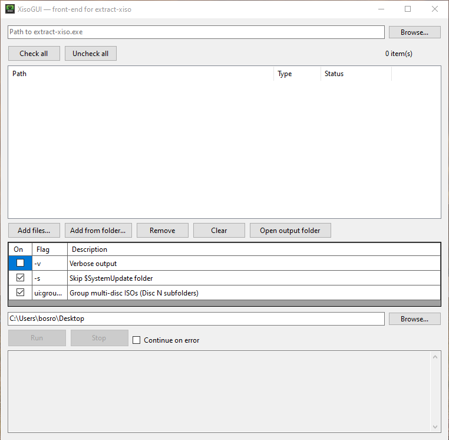

# 🟩 XisoGUI  
**A simple Windows GUI for the `extract-xiso` tool — extract and manage Xbox & Xbox 360 ISOs with ease.**

  


---

## 🎯 Overview
**XisoGUI** is a lightweight Windows Forms application that provides an easy-to-use graphical interface for the command-line tool [`extract-xiso`](https://github.com/XboxDev/extract-xiso).

It automates ISO extraction, multi-disc grouping, duplicate checks, and destination management — perfect for batch-extracting Xbox or Xbox 360 game images to folders.

---

## ✨ Features

| Category | Description |
|-----------|-------------|
| 💿 **ISO Extraction** | Batch extract `.iso` and `.xiso` files using `extract-xiso.exe`. |
| 🧩 **Auto-detect / Download** | Automatically downloads `extract-xiso.exe` if it’s missing. |
| 🗂️ **Disc Grouping** | Detects “Disc 1”, “Disc 2”, etc., and extracts into subfolders. |
| 🚫 **Skip Duplicates** | Prevents the same ISO from being added multiple times. |
| 🔘 **Checkbox Control** | Check only the games you want to extract. |
| 🧾 **Continue / Stop on Error** | Choose whether the queue stops or continues after errors. |
| ⚙️ **Overwrite Prompt** | Prompts when a target folder exists → **Yes = Overwrite**, **No = Skip**, **Cancel = Stop**. |
| 📁 **Open Output Folder** | Quickly open the extraction directory. |
| ✅ **Check All / Uncheck All** | Fast selection toggles for large ISO lists. |
| 🪶 **Portable** | Runs as a single self-contained `.exe` — no installation required. |

---

## 🖥️ Requirements
- Windows 10 or later  
- [.NET 8.0 Runtime](https://dotnet.microsoft.com/en-us/download/dotnet/8.0) (if not using the self-contained build)  
- `extract-xiso.exe` (auto-download supported)

---

## 🚀 Usage

1. **Launch `XisoGUI.exe`**
2. **Select ISO files or a folder**  
   - Use **Add Files** or **Add from Folder**
3. **Set the output directory**
4. *(Optional)* Toggle advanced options:
   - `-s` Skip `$SystemUpdate`
   - “Group multi-disc ISOs”
   - “Continue on error”
5. **Click Run**
6. When prompted:  
   - **Yes** → overwrite existing folders  
   - **No** → skip that ISO  
   - **Cancel** → stop the whole queue  

---

## 📦 Building from source

```bash
git clone https://github.com/TheRealNextria/XisoGUI.git
cd XisoGUI
dotnet publish -c Release -r win-x64 -p:PublishSingleFile=true -p:SelfContained=true
```

Output will be in:

```
bin\Release\net8.0-windows\win-x64\publish\
```

---

## 🧠 Notes

- Works with both **original Xbox** and **Xbox 360** ISOs.  
- Extraction uses the same logic as the official `extract-xiso` tool — no content modification.  
- Folder naming and disc grouping use pattern detection for `Disc`, `DVD`, `CD`, etc.  

---

## 🛠️ Credits

- Core extraction by [XboxDev / extract-xiso](https://github.com/XboxDev/extract-xiso)  
- GUI by Nextria
- Icon design by ChatGPT + Xbox-themed vector set

---

## 📜 License

MIT License — see [`LICENSE`](LICENSE) for details.
